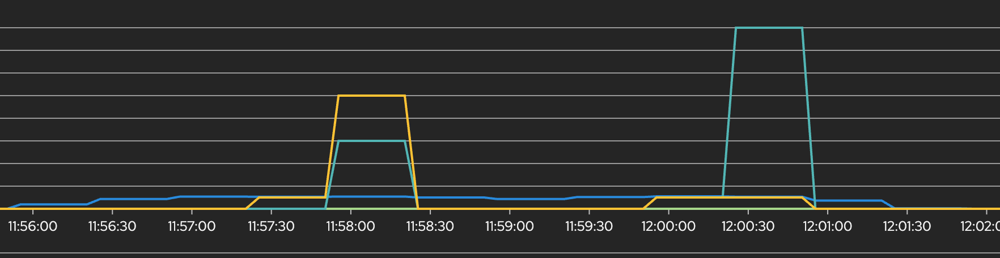
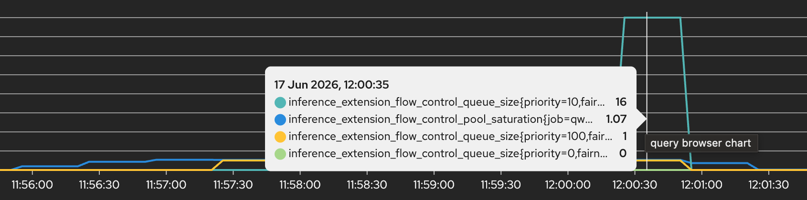

# LLM-D Flow Control Test

A test to demonstrate flow control effectiveness in LLM-D, by sending alternating priority requests. The test best shows the benefits of flow control by saturating the model.

Originally tested under the following configuration:

System Config:

- OpenShift Version: 4.20.0
- OpenShift AI Version: 3.4.0
- Connectivity Link: 1.3.4

Model Deployment Config:

- Single replica Qwen3.5-4B
- NVIDIA L4 w/24GB VRAM

> **_NOTE:_** The default test config in `test_config.yaml` assumes you deployed the model via the [helm chart](https://github.com/rh-aiservices-bu/llm-d-flowcontrol/tree/main/helm-chart) in the root of this repository. If you didn't, you will likely need to change the config to ensure the script looks for the correct `LLMInferenceService` object, and service accounts.

## Overview

This test runs concurrent workers split 50/50 between high-priority and low-priority requests to demonstrate that flow control provides preferential treatment to high-priority requests under load.

## Prerequisites

- OpenShift cluster with LLM-D deployed
- `oc` CLI installed and logged in
- Python 3.7+ with `aiohttp` and `pyyaml` packages

## Quick Start

This can be done in a virtual environment if preferred.

```bash
# Install dependencies
pip install aiohttp pyyaml

# Run test with default settings (130 workers, 240s duration)
python3 flow_control_test.py

# Run with custom settings
python3 flow_control_test.py --workers 100 --duration 180
```

## Configuration

Edit `test_config.yaml` to configure:

- **Endpoint**: Service account namespaces, LLMInferenceService details
- **Test**: Concurrent workers, duration, worker stagger delay, queue monitoring
- **Request**: Token limits, timeout, temperature

## What It Tests

The script:
1. Spawns N concurrent workers (default 130).
2. Half send **high-priority** requests continuously.
3. Half send **low-priority** requests continuously.
4. Both use identical prompts and token sizes for a fair comparison.
5. Monitors queue metrics every 10 seconds.
6. Runs for configured duration (default 240s).

## Output

Results are saved to `trace_results/flow-control_YYYYMMDD_HHMMSS/`:
- `summary.json` - Full metrics and comparison
- `prompts.txt` - Prompts used in test

### Metrics Compared

- **Success Rate**: High vs low priority completion rate
- **E2E Latency**: Mean and P95 end-to-end latency
- **TTFT**: Time to first token (queue wait time)

### Expected Results

With the default configuration and test, the runtime of the test will be about 7-8 minutes.

When flow control is working:
- High-priority requests have **higher success rate** (e.g., 100% vs 70%) with (usually) a **higher request amount**.
- High-priority requests have **lower TTFT** due to skipping the queue. (e.g., ~40% better)
- High-priority requests have **the same or lower E2E latency**.

## Example Output

```
📊 PRIORITY COMPARISON
================================================================================

📈 Request Volume:
  High-priority: 130 requests
  Low-priority: 100 requests

✅ Success Rates:
  High-priority: 100.0%
  Low-priority: 71.0%
  Difference: +29.0%

⏱️  End-to-End Latency (successful requests):
  High-priority mean: 142.39s
  Low-priority mean: 144.20s
  Difference: +1.3% 

  High-priority P95: 167.38s
  Low-priority P95: 162.17s
  Difference: -3.2%

⚡ Time to First Token (successful requests):
  High-priority mean: 3.42s
  Low-priority mean: 5.56s
  Difference: +38.5% (1.6x faster)

📈 Summary:
  ✅ High-priority achieved 29.0% higher success rate
  ✅ High-priority TTFT 38.5% better
```

## OpenShift Metrics

When llm-d is configured with flow control, it will expose the following metrics that can be used to watch the effect of the test as it runs. These are below:

  - `inference_extension_flow_control_queue_size` : Tracks the queue size of each flow key.
  - `inference_extension_flow_control_pool_saturation` : Tracks the saturation of the InferencePool. Only once this goes past 1.0, the queues for the flow keys will start to climb.

If you watch these on the OpenShift Console via **Observe > Metrics** and putting them into 2 separate queries, you should have something like below:



And if you mouse over the graph, you should see that predominantely the lower-priority requests are queuing more than the higher priority ones.



## Troubleshooting

**HTTP 401 errors**: This is likely to be from the authentication service rate limiting the requests. This occurs when too many concurrent requests happen at once, without enough delay between them. This can be fixed by increasing the `worker_stagger_delay` value in `test_config.yaml` (default: 0.100 seconds / 100ms).

**High timeout rate**: This occurs when the system is under too much load, either reduce `concurrent_requests` in config or decrease the request token.

**No queue formation**: Double check the `inference_extension_flow_control_pool_saturation` metric to see if the pool saturation is hitting >1 regularly. If not, increase `concurrent_requests` or `max_tokens`.

## Files

- `flow_control_test.py` - Single-file test script with all functionality.
- `test_config.yaml` - Configuration file.
